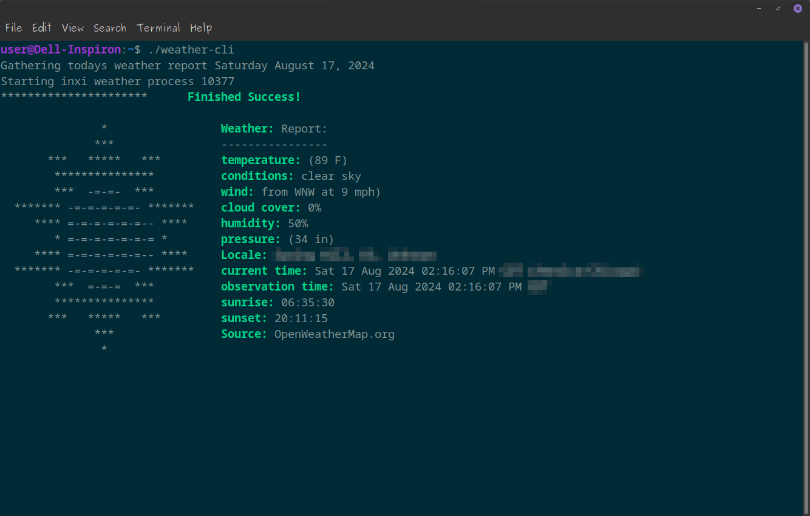

### Fun Bash Scripts  📃   Weather_CLI  ⛅  And Github Profile  🎉

---
- Hi, I’m @AptGetMe, the maintainer.
- I’m interested in the QT framework apps written in both C++ or Python languages.
- I have also tried some JavaScript, Bash, SDL framework, SFML framework and a little of everything else.  

>[!NOTE]   
>My plan for the future is to fill this repository with fun (and maybe useful) bash scripts.

# Weather_CLI  ⛅

### A Command Line Interface weather tool similar to [wthrr](https://github.com/ttytm/wthrr-the-weathercrab) or [wego](https://github.com/schachmat/wego) but displayed like [neofetch](https://github.com/dylanaraps/neofetch)

Weather_CLI aims to be an easy to use weather app that retrieves the current weather conditions and display them in a linux bash terminal.
While Weather_CLI is pretty simple to use, please don't hesitate to check [documentation](Weather_CLI_DOC.md) for help installing and using Weather_CLI.
Currently under development, but a release may be happening soon...
  
<!---
AptGetMe/AptGetMe is a ✨ special ✨ repository because its `README.md` (this file) appears on your GitHub profile.
You can click the Preview link to take a look at your changes.
--->
