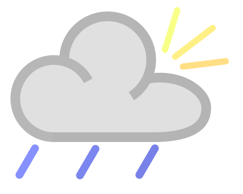

<div align="center">

# Weather_CLI


A Command Line Interface **(CLI)** weather tool similar to [wthrr](https://github.com/ttytm/wthrr-the-weathercrab) or [wego](https://github.com/schachmat/wego) but with a view like [neofetch](https://github.com/dylanaraps/neofetch). 

</div>

---

This file contains some instructions that should help you install and use **Weather_CLI.**  

>[!NOTE]
>At the bottom of this page, I've included some development pointers for those interested in contributing.

>[!IMPORTANT]
>**Weather_CLI** is in development and is unstable.  
>**Weather_CLI** has only been tested on Debian Linux system, but will probably work on other distros.  
>Mac and Windows is currently untested.

# Install
- On main github code page, click on the *weather-cli* file
- Click on the *Download raw file* button
- Right click on downloaded *weather-cli* file and allow execution permissions

# How to Use!
- Open a regular bash terminal and navigate to the folder containing the downloaded *weather-cli* file.
- Run script by typing in the command ```./weather-cli```


# Development
>[!TIP]
>A bash terminal and a text editor is sufficient for developing bash scripts!  However, here are some recommendations that may make the task easier.
>- Develope on a ***Linux*** installation (Debian is even better).
>- Use ***VSCode*** as the code editor with the ***ShellCheck*** extension installed

- Clone Github Repository ```https://github.com/AptGetMe/AptGetMe.git```
- Open *weather-cli* file in VSCode
- Test to make sure the environments is working by by running script with ```./weather-cli```
- Open a new pull request to submit changes!
